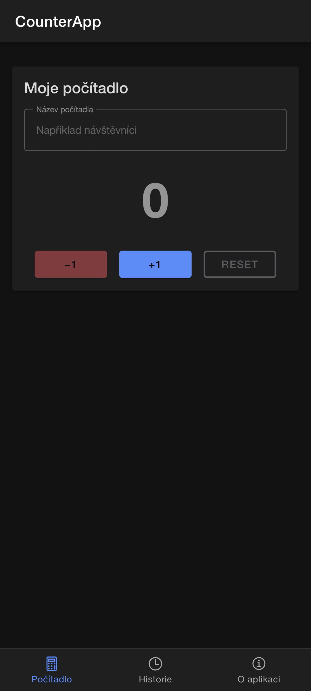

# CV2 – CounterApp: záložky, datové vazby a Ionic komponenty

## Cíl cvičení

Vytvoříte jednoduchou aplikaci **CounterApp** se třemi záložkami. Na první záložce bude uživatel zadávat název počítadla, měnit jeho hodnotu a počítadlo resetovat.

Po dokončení cvičení budete umět:

- vytvořit Ionic projekt ze šablony `tabs`,
- rozlišit TypeScript, HTML šablonu a SCSS styl komponenty,
- používat interpolaci `{{ }}` a datové vazby Angularu,
- reagovat na událost `(click)`,
- použít obousměrnou vazbu `[(ngModel)]`,
- importovat Ionic komponenty do Standalone komponenty,
- upravit navigační záložky a ikony,
- uložit dokončenou práci do lokálního Git repozitáře.

V CV2 aplikaci stále spouštíme pouze v prohlížeči. Android projekt a emulátor přidáme v některém z následujících cvičení.

## 1. Výsledná aplikace

CounterApp bude obsahovat:

1. záložku **Počítadlo** s názvem a aktuální hodnotou,
2. záložku **Historie**, kterou využijeme později,
3. záložku **O aplikaci** pro informace o autorovi.

Na první záložce bude možné:

- zadat vlastní název počítadla,
- zvýšit hodnotu o jedna,
- snížit hodnotu o jedna, ale ne pod nulu,
- vrátit hodnotu na nulu.

Data zatím nebudou trvale uložena. Po obnovení stránky se počítadlo vrátí do výchozího stavu. Perzistenci doplníme později pomocí Capacitoru.



## 2. Kontrola prostředí (Volitelně)

### Windows – PowerShell

```powershell
node --version
npm --version
git --version
ionic --version
```

### macOS – Terminal

```bash
node --version
npm --version
git --version
ionic --version
```

Příkazy jsou na obou platformách stejné. Očekáváme Node.js 26, npm 11 a funkční Ionic CLI.

Pokud používáte `nvm`, aktivujte před prací Node.js 26.

### Windows – PowerShell s nvm-windows

```powershell
nvm use 26
node --version
```

### macOS – Terminal s nvm

```bash
nvm use 26
node --version
```

## 3. Vytvoření pracovního adresáře (Pokud již nemáte)

Projekt nevytvářejte uvnitř adresáře `cviceni`. Výukové pokyny a vlastní zdrojové kódy tak zůstanou oddělené.

### Windows – PowerShell

```powershell
New-Item -ItemType Directory -Force -Path "$HOME\AP5PM-projekty" | Out-Null
Set-Location "$HOME\AP5PM-projekty"
```

### macOS – Terminal

```bash
mkdir -p "$HOME/AP5PM-projekty"
cd "$HOME/AP5PM-projekty"
```

## 4. Vytvoření projektu CounterApp

### Windows – PowerShell

```powershell
ionic start counter-app tabs --type=angular-standalone --capacitor
Set-Location counter-app
code .
```

### macOS – Terminal

```bash
ionic start counter-app tabs --type=angular-standalone --capacitor
cd counter-app
code .
```

Parametry příkazu znamenají:

- `counter-app` – název adresáře a projektu,
- `tabs` – výchozí šablona se třemi záložkami,
- `--type=angular-standalone` – Angular se Standalone komponentami,
- `--capacitor` – příprava projektu pro pozdější Android a iOS build.

Pokud nástroj nabídne vytvoření bezplatného Ionic účtu, můžete tuto možnost přeskočit.

> **Pozor:** Nepoužívejte pouze `--type=angular`. Tato hodnota vytváří odlišnou variantu založenou na NgModule a soubory by neodpovídaly tomuto návodu.

Pokud na macOS příkaz `code .` není dostupný, použijte:

```bash
open -a "Visual Studio Code" .
```

Projekt můžete také otevřít přímo ve VS Code pomocí **File → Open Folder**.

## 5. První spuštění

Příkaz spusťte v adresáři `counter-app`.

### Windows – PowerShell

```powershell
ionic serve
```

### macOS – Terminal

```bash
ionic serve
```

V prohlížeči otevřete adresu:

```text
http://localhost:8100
```

Vyzkoušejte všechny tři záložky. Vývojový server nechte běžet; po uložení souboru se aplikace automaticky obnoví. Server později ukončíte pomocí `Ctrl+C` na Windows i macOS.

## 6. Struktura projektu

Prohlédněte si především adresář `src/app`:

```text
src/app/
├── tab1/
│   ├── tab1.page.ts
│   ├── tab1.page.html
│   ├── tab1.page.scss
│   └── tab1.page.spec.ts
├── tab2/
├── tab3/
├── tabs/
│   ├── tabs.page.ts
│   ├── tabs.page.html
│   └── tabs.routes.ts
└── app.routes.ts
```

Význam nejdůležitějších souborů:

| Soubor | Úloha |
| --- | --- |
| `*.page.ts` | Stav komponenty a aplikační logika v TypeScriptu |
| `*.page.html` | Uživatelské rozhraní a datové vazby |
| `*.page.scss` | Styly platné pro danou stránku |
| `tabs.routes.ts` | Cesty k jednotlivým záložkám |
| `app.routes.ts` | Kořenové směrování aplikace |

Komponenta v tomto projektu není klasická MVC aplikace. Pro začátek si ji lze představit jako spojení stavu a logiky v `.ts`, šablony v `.html` a vzhledu v `.scss`.

## 7. Implementace logiky počítadla

Otevřete soubor:

```text
src/app/tab1/tab1.page.ts
```

Nahraďte jeho obsah následujícím kódem:

```typescript
import { Component } from '@angular/core';
import { FormsModule } from '@angular/forms';
import {
  IonButton,
  IonCard,
  IonCardContent,
  IonCardHeader,
  IonCardTitle,
  IonContent,
  IonHeader,
  IonInput,
  IonTitle,
  IonToolbar,
} from '@ionic/angular';

@Component({
  selector: 'app-tab1',
  templateUrl: 'tab1.page.html',
  styleUrls: ['tab1.page.scss'],
  imports: [
    FormsModule,
    IonButton,
    IonCard,
    IonCardContent,
    IonCardHeader,
    IonCardTitle,
    IonContent,
    IonHeader,
    IonInput,
    IonTitle,
    IonToolbar,
  ],
})
export class Tab1Page {
  counterName = '';
  count = 0;

  increment(): void {
    this.count++;
  }

  decrement(): void {
    if (this.count > 0) {
      this.count--;
    }
  }

  reset(): void {
    this.count = 0;
  }
}
```

Co je důležité:

- `counterName` a `count` představují stav komponenty,
- metody mění stav po akci uživatele,
- `FormsModule` zpřístupňuje `ngModel`,
- každá Ionic komponenta použitá v HTML musí být uvedena v poli `imports`.

## 8. Implementace šablony

Otevřete:

```text
src/app/tab1/tab1.page.html
```

Nahraďte celý obsah:

```html
<ion-header [translucent]="true">
  <ion-toolbar>
    <ion-title>CounterApp</ion-title>
  </ion-toolbar>
</ion-header>

<ion-content [fullscreen]="true" class="ion-padding">
  <ion-card>
    <ion-card-header>
      <ion-card-title>
        {{ counterName || 'Moje počítadlo' }}
      </ion-card-title>
    </ion-card-header>

    <ion-card-content>
      <ion-input
        label="Název počítadla"
        label-placement="stacked"
        fill="outline"
        placeholder="Například návštěvníci"
        [(ngModel)]="counterName"
      ></ion-input>

      <p class="counter-value">{{ count }}</p>

      <div class="counter-actions">
        <ion-button
          color="danger"
          [disabled]="count === 0"
          (click)="decrement()"
        >
          −1
        </ion-button>

        <ion-button color="primary" (click)="increment()">
          +1
        </ion-button>

        <ion-button
          color="medium"
          fill="outline"
          [disabled]="count === 0"
          (click)="reset()"
        >
          Reset
        </ion-button>
      </div>
    </ion-card-content>
  </ion-card>
</ion-content>
```

> **Poznámka – značka v HTML nestačí:** Každá značka Ionic použitá v šabloně musí být zpřístupněna také ve Standalone komponentě v souboru `tab1.page.ts`. Například `<ion-card>` odpovídá třídě `IonCard`, `<ion-button>` třídě `IonButton` a `<ion-input>` třídě `IonInput`. Třída musí být jednak importována z balíčku `@ionic/angular`, jednak uvedena v poli `imports` dekorátoru `@Component`. Pokud některý z těchto kroků chybí, Angular značku nezná a sestavení skončí chybou typu `ion-card is not a known element`.
>
> Ve VS Code lze import často doplnit automaticky. Umístěte kurzor na červeně podtrženou značku v HTML a otevřete nabídku **Quick Fix** pomocí `Ctrl+.` na Windows/Linuxu nebo `Cmd+.` na macOS. Zvolte nabídku pro import příslušné komponenty do `Tab1Page`. Angular Language Service následně doplní TypeScript import a položku do pole `imports`. Po automatické úpravě vždy otevřete `tab1.page.ts` a oba kroky zkontrolujte. Pokud se Quick Fix nenabízí, uložte oba soubory, zkontrolujte rozšíření Angular Language Service a import doplňte ručně podle příkladu v předchozí kapitole.

Převod nejčastěji použitých prvků v této šabloně:

| HTML šablona | Import v `tab1.page.ts` |
| --- | --- |
| `<ion-header>` | `IonHeader` |
| `<ion-toolbar>` | `IonToolbar` |
| `<ion-title>` | `IonTitle` |
| `<ion-content>` | `IonContent` |
| `<ion-card>` | `IonCard` |
| `<ion-card-header>` | `IonCardHeader` |
| `<ion-card-title>` | `IonCardTitle` |
| `<ion-card-content>` | `IonCardContent` |
| `<ion-input>` | `IonInput` |
| `<ion-button>` | `IonButton` |

`[(ngModel)]` není Ionic značka. Tuto Angular direktivu zpřístupňuje `FormsModule`, který musí být stejným způsobem importovaný a uvedený v poli `imports`.

Použité datové vazby:

| Zápis | Význam |
| --- | --- |
| `{{ count }}` | Interpolace – vypíše hodnotu z TypeScriptu |
| `(click)="increment()"` | Event binding – zavolá metodu po kliknutí |
| `[disabled]="count === 0"` | Property binding – nastaví vlastnost elementu |
| `[(ngModel)]="counterName"` | Obousměrná vazba – synchronizuje vstup a stav |

Zápisu `[()]` se někdy říká „banana in a box“: hranaté závorky posílají hodnotu do komponenty a kulaté závorky reagují na její změnu.

## 9. Stylování stránky

Otevřete:

```text
src/app/tab1/tab1.page.scss
```

Nahraďte obsah:

```scss
ion-card {
  max-width: 32rem;
  margin: 1rem auto;
}

.counter-value {
  margin: 2rem 0;
  font-size: 4rem;
  font-weight: 700;
  line-height: 1;
  text-align: center;
}

.counter-actions {
  display: flex;
  flex-wrap: wrap;
  gap: 0.75rem;
  justify-content: center;
}

.counter-actions ion-button {
  min-width: 6rem;
}
```

SCSS v tomto souboru se vztahuje pouze ke stránce `Tab1Page`. Třídy použité v HTML se zapisují s tečkou, například `.counter-value`.

## 10. Úprava navigačních záložek

V souboru `src/app/tabs/tabs.page.ts` nahraďte původní ikony:

```typescript
import { Component, EnvironmentInjector, inject } from '@angular/core';
import {
  IonIcon,
  IonLabel,
  IonTabBar,
  IonTabButton,
  IonTabs,
} from '@ionic/angular';
import { addIcons } from 'ionicons';
import {
  calculatorOutline,
  informationCircleOutline,
  timeOutline,
} from 'ionicons/icons';

@Component({
  selector: 'app-tabs',
  templateUrl: 'tabs.page.html',
  styleUrls: ['tabs.page.scss'],
  imports: [IonTabs, IonTabBar, IonTabButton, IonIcon, IonLabel],
})
export class TabsPage {
  public environmentInjector = inject(EnvironmentInjector);

  constructor() {
    addIcons({
      calculatorOutline,
      informationCircleOutline,
      timeOutline,
    });
  }
}
```

Potom upravte `src/app/tabs/tabs.page.html`:

```html
<ion-tabs>
  <ion-tab-bar slot="bottom">
    <ion-tab-button tab="tab1" href="/tabs/tab1">
      <ion-icon aria-hidden="true" name="calculator-outline"></ion-icon>
      <ion-label>Počítadlo</ion-label>
    </ion-tab-button>

    <ion-tab-button tab="tab2" href="/tabs/tab2">
      <ion-icon aria-hidden="true" name="time-outline"></ion-icon>
      <ion-label>Historie</ion-label>
    </ion-tab-button>

    <ion-tab-button tab="tab3" href="/tabs/tab3">
      <ion-icon
        aria-hidden="true"
        name="information-circle-outline"
      ></ion-icon>
      <ion-label>O aplikaci</ion-label>
    </ion-tab-button>
  </ion-tab-bar>
</ion-tabs>
```

Hodnoty `tab="tab1"` a `href="/tabs/tab1"` neměňte. Odpovídají cestám definovaným v `tabs.routes.ts`.

## 11. Informace o autorovi

Na třetí záložce upravte:

```text
src/app/tab3/tab3.page.html
```

Odstraňte element `app-explore-container` a do `ion-content` vložte vlastní jméno, například:

```html
<div class="ion-padding">
  <h2>O aplikaci</h2>
  <p>Autor: Jméno a příjmení</p>
  <p>AP5PM 2026</p>
</div>
```

Zbytek vygenerované hlavičky stránky můžete ponechat. Název `Tab 3` v obou elementech `ion-title` změňte na `O aplikaci`.

## 12. Ověření funkčnosti

V prohlížeči ověřte:

1. zadávaný název se ihned objevuje v titulku karty,
2. tlačítko `+1` zvyšuje hodnotu,
3. tlačítko `−1` hodnotu snižuje, ale nikdy pod nulu,
4. tlačítko `Reset` nastaví nulu,
5. tlačítka pro snížení a reset jsou při nule zakázána,
6. funguje přepínání všech tří záložek,
7. třetí záložka obsahuje vaše jméno.

Otevřete Developer Tools prohlížeče a zkontrolujte, že v konzoli nejsou červené chyby. Zapněte simulaci mobilního displeje a vyzkoušejte úzkou i širokou obrazovku.

## 13. Minimální automatizované testy

Ruční vyzkoušení aplikace v prohlížeči je důležité, ale při každé další změně bychom museli všechny situace kontrolovat znovu. Několik malých automatizovaných testů dokáže rychle ověřit základní pravidla počítadla.

Projekt vytvořený pomocí Angularu 22 již obsahuje testovací nástroje a soubor:

```text
src/app/tab1/tab1.page.spec.ts
```

Přípona `.spec.ts` označuje soubor s testy. Testy se nepřidávají do výsledné aplikace určené uživatelům.

### Úprava testu komponenty

Otevřete `src/app/tab1/tab1.page.spec.ts` a nahraďte jeho obsah:

```typescript
import { ComponentFixture, TestBed } from '@angular/core/testing';
import { beforeEach, describe, expect, it } from 'vitest';
import { Tab1Page } from './tab1.page';

describe('Tab1Page', () => {
  let component: Tab1Page;
  let fixture: ComponentFixture<Tab1Page>;

  beforeEach(() => {
    fixture = TestBed.createComponent(Tab1Page);
    component = fixture.componentInstance;
    fixture.detectChanges();
  });

  it('should create', () => {
    expect(component).toBeTruthy();
  });

  it('should increment the counter', () => {
    component.increment();

    expect(component.count).toBe(1);
  });

  it('should decrement but never go below zero', () => {
    component.decrement();
    expect(component.count).toBe(0);

    component.count = 2;
    component.decrement();
    expect(component.count).toBe(1);
  });

  it('should reset the counter and update the template', () => {
    component.count = 5;
    component.reset();
    fixture.detectChanges();

    const value = fixture.nativeElement.querySelector(
      '.counter-value',
    ) as HTMLElement;

    expect(component.count).toBe(0);
    expect(value.textContent?.trim()).toBe('0');
  });
});
```

### Jak test funguje

| Zápis | Význam |
| --- | --- |
| `describe()` | Seskupuje testy jedné komponenty. |
| `beforeEach()` | Před každým testem vytvoří novou čistou instanci stránky. |
| `TestBed.createComponent()` | Vytvoří komponentu a její testovací HTML. |
| `fixture.componentInstance` | Zpřístupní instanci třídy `Tab1Page`. |
| `it()` | Definuje jeden konkrétní testovaný scénář. |
| `expect(...).toBe(...)` | Porovná skutečný a očekávaný výsledek. |
| `fixture.detectChanges()` | Promítne změněný stav komponenty do HTML šablony. |
| `querySelector()` | Najde prvek ve vykreslené testovací šabloně. |

Funkce `describe`, `beforeEach`, `it` a `expect` pocházejí z Vitestu. Importujeme je explicitně, aby jejich původ byl zřejmý a aby správně fungovalo našeptávání i typová kontrola v editoru. Není potřeba instalovat typy pro Jest ani Mocha.

Každý test má ověřovat jednu srozumitelnou vlastnost. Test ochrany proti záporné hodnotě kontroluje obě větve: při nule se hodnota nezmění a při kladné hodnotě se sníží.

Poslední test nejprve ověřuje stav TypeScript komponenty a potom také text zobrazený v HTML. Volání `fixture.detectChanges()` je nutné, protože změna vlastnosti v testu se do šablony nepromítne automaticky ve stejném okamžiku.

### Spuštění testů

Pro jednorázové spuštění všech testů použijte:

```bash
npm test -- --watch=false
```

Úspěšný výstup obsahuje počet testovacích souborů a testů se stavem `passed`. Pokud test neprojde, Vitest vypíše název scénáře, očekávanou hodnotu a skutečný výsledek.

Během vývoje lze spustit watch režim:

```bash
npm test
```

Proces zůstane spuštěný a po uložení zdrojového nebo testovacího souboru testy zopakuje. Ukončíte jej pomocí `Ctrl+C`.

Chcete-li jednorázově spustit pouze test první záložky, použijte:

```bash
npm test -- --watch=false --include=src/app/tab1/tab1.page.spec.ts
```

> **Důležité:** Procházející testy neznamenají, že je aplikace bezchybná. Ověřují pouze scénáře, které jsme skutečně zapsali. Nenahrazují proto ruční kontrolu vzhledu, ovládání a navigace v prohlížeči.

## 14. Produkční sestavení webové části

Nejprve ukončete `ionic serve` pomocí `Ctrl+C`. Potom ověřte, že se projekt dokáže sestavit bez vývojového serveru.

### Windows – PowerShell

```powershell
ionic build
```

### macOS – Terminal

```bash
ionic build
```

Úspěšný příkaz vytvoří webové soubory v adresáři `www`. Tento adresář bude Capacitor později kopírovat do Android nebo iOS projektu.

## 15. Uložení práce do Gitu

Nejprve zkontrolujte stav repozitáře.

### Windows – PowerShell

```powershell
git status
```

### macOS – Terminal

```bash
git status
```

Pokud Git oznámí, že nejste uvnitř repozitáře, inicializujte jej:

### Windows – PowerShell

```powershell
git init
```

### macOS – Terminal

```bash
git init
```

Uložte stav po dokončení CV2.

### Windows – PowerShell

```powershell
git add .
git commit -m "Implementace zakladniho pocitadla"
```

### macOS – Terminal

```bash
git add .
git commit -m "Implementace zakladniho pocitadla"
```

Do Gitu nepatří adresář `node_modules`. Vygenerovaný projekt jej již má uvedený v `.gitignore`. Před commitem si vždy prohlédněte výstup `git status`.

## 16. Kontrolní seznam CV2

- [ ] Projekt byl vytvořen s typem `angular-standalone` a šablonou `tabs`.
- [ ] Aplikace se spustí pomocí `ionic serve`.
- [ ] Rozumím úloze souborů `.ts`, `.html` a `.scss`.
- [ ] Vím k čemu slouží importy `IonButton, IonCard, IonCardContent IonCardHeader...` v souboru `tab1.page.ts`.
- [ ] Název počítadla funguje přes `[(ngModel)]`.
- [ ] Hodnota se zobrazuje pomocí interpolace.
- [ ] Tlačítka volají metody přes událost `(click)`.
- [ ] Hodnota počítadla nemůže být záporná.
- [ ] Záložky mají nové názvy a ikony.
- [ ] Záložka O aplikaci obsahuje mé jméno.
- [ ] Testy ověřují inkrementaci, snížení bez záporné hodnoty a reset.
- [ ] `npm test -- --watch=false` skončí bez chyby.
- [ ] Příkaz `ionic build` skončí bez chyby.
- [ ] Změny jsou uloženy v lokálním Git commitu.

## 17. Bonusové úkoly

Po dokončení povinné části můžete:

1. přidat tlačítka `+5` a `−5`,
2. přidat vlastnost `step` a vstup pro velikost kroku,
3. barevně odlišit nulovou a kladnou hodnotu,
4. doplnit tlačítko, které vymaže současně hodnotu i název.

Bonus nesmí porušit pravidlo, že hodnota nemůže klesnout pod nulu.

## 18. Nejčastější problémy

### `Cannot find name 'describe'`

Projekt používá testovací nástroj Vitest, nikoliv Jest nebo Mocha. Neinstalujte proto balíčky `@types/jest` ani `@types/mocha`. Na začátku souboru `tab1.page.spec.ts` musí být explicitní import:

```typescript
import { beforeEach, describe, expect, it } from 'vitest';
```

Pokud editor stále hlásí chybu:

1. zkontrolujte, že je soubor uložený jako `src/app/tab1/tab1.page.spec.ts`,
2. v kořeni projektu spusťte `npm ls vitest`,
3. pokud chybí celý adresář `node_modules`, spusťte `npm install`,
4. zkontrolujte, že `tsconfig.spec.json` zahrnuje soubory `src/**/*.spec.ts`,
5. ve VS Code otevřete paletu příkazů a spusťte **TypeScript: Restart TS Server**.

Správnost testovacího prostředí nakonec ověřte příkazem:

```bash
npm test -- --watch=false --include=src/app/tab1/tab1.page.spec.ts
```

### `Can't bind to 'ngModel'`

V `tab1.page.ts` zkontrolujte import:

```typescript
import { FormsModule } from '@angular/forms';
```

`FormsModule` musí být současně uvedený v poli `imports` dekorátoru `@Component`.

### `ion-card is not a known element`

Příslušná Ionic komponenta chybí v TypeScript importech nebo v poli `imports`. Zkontrolujte například `IonCard`, `IonCardHeader`, `IonCardTitle` a `IonCardContent`. Na podtržené značce můžete otevřít Quick Fix pomocí `Ctrl+.` na Windows/Linuxu nebo `Cmd+.` na macOS a nechat VS Code import doplnit.

### Tlačítko nic nedělá

Zkontrolujte:

- kulaté závorky v `(click)`,
- přesný název metody,
- závorky za metodou, například `(click)="increment()"`,
- chyby v konzoli prohlížeče a terminálu.

### Po obnovení stránky je hodnota opět nula

V CV2 je to očekávané chování. Stav je pouze v operační paměti komponenty. Trvalé ukládání doplníme v dalším cvičení.

### `npm audit` hlásí zranitelnosti

Bez pokynu vyučujícího nespouštějte `npm audit fix --force`. Příkaz může změnit hlavní verze závislostí a výukový projekt rozbít.

## Oficiální dokumentace

- [Ionic – Angular Navigation](https://ionicframework.com/docs/angular/navigation)
- [Ionic UI Components](https://ionicframework.com/docs/components)
- [Angular – Binding dynamic text, properties and attributes](https://angular.dev/guide/templates/binding)
- [Angular – Adding event listeners](https://angular.dev/guide/templates/event-listeners)
- [Angular – Two-way binding](https://angular.dev/guide/templates/two-way-binding)
- [Angular – Importing and using components](https://angular.dev/guide/components/importing)
- [Angular – Basics of testing components](https://angular.dev/guide/testing/components-basics)
- [Angular CLI – `ng test`](https://angular.dev/cli/test)
